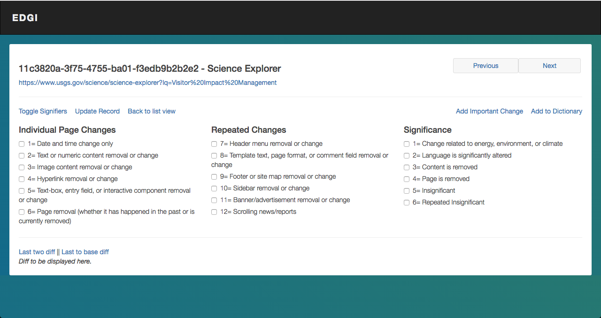

[](https://github.com/edgi-govdata-archiving/overview/blob/main/CONDUCT.md) &nbsp;[](https://github.com/orgs/edgi-govdata-archiving/projects/32)


# web-monitoring-ui

This repository is part of the EDGI [Web Monitoring Project](https://github.com/edgi-govdata-archiving/web-monitoring).

This component works with [web-monitoring-db](https://github.com/edgi-govdata-archiving/web-monitoring-db) and [web-monitoring-processing](https://github.com/edgi-govdata-archiving/web-monitoring-processing) to support the next web monitoring workflow.

It’s a React.js-based browser application with a Node.js backend with the following capabilities:
* Consume subset of data from web-monitoring-db as proof of concept, read/write annotations
    * [DEMO](https://monitoring-staging.envirodatagov.org)
    * LIST VIEW shows first page of records from [web-monitor-db](https://api.monitoring-staging.envirdatagov.org/api/v0/pages) JSON endpoint
    * PAGE VIEW shows basic info about the latest version of that page: site, URLs and links to Wayback Machine calendar view and page versions
        * updates annotations


## Installation

1. Install Node 24.15.0.
    - We recommend using [Nodenv][nodenv], which will automatically select the correct version of Node.js to run for you.
        - If you don’t yet have the right version of Node.js installed, enter the root directory for this project and then run `nodenv install`.
    - Alternatively, you can use [NVM][nvm] or a variety of [alternatives][nodenv-alternatives] for managing multiple versions of Node.js.

2. Install node dependencies with `npm`

    ```sh
    npm install
    ```

3. Copy `.env.example` to `.env` and supply any local configuration info you need (all fields are optional). The default env should work standalone for development.

4. Start the web server!

    ```sh
    npm start
    ```

    …and point your browser to http://localhost:3001 to view the app.

[nodenv]: https://github.com/nodenv/nodenv
[nodenv-alternatives]: https://github.com/nodenv/nodenv/wiki/Alternatives
[nvm]: https://github.com/creationix/nvm


## Running tests

To run all tests once

```sh
npm test
```

while to start the test runner in watch mode

```sh
npm run test-watch
```


## Manual view
Access the main view at `http://localhost:3001`

Screenshot:


## Code of Conduct

This repository falls under EDGI's [Code of Conduct](https://github.com/edgi-govdata-archiving/overview/blob/main/CONDUCT.md).


## Getting Involved

We need your help! Please read through the [Web Monitoring Project](https://github.com/edgi-govdata-archiving/web-monitoring) project document and see what you can help with and check [EDGI’s contribution guidelines](https://github.com/edgi-govdata-archiving/overview/blob/main/CONTRIBUTING.md) for information on how to propose issues or changes.


## Docker

You can also run this project via Docker. To build and run (on port 3001, as in the instructions for running directly above):

```
docker build -t envirodgi/ui .
docker run -p 3001:3001 -e <ENVIRONMENT VARIABLES> envirodgi/ui
```

Point your browser to ``http://localhost:3001``.

To run tests via Docker:

```
docker build -t envirodgi/ui:dev --target dev .
docker run envirodgi/ui:dev npm run test
```


## Releases

New releases of the app are published automatically as Docker images by CircleCI when someone pushes to the `release` branch. They are availble at https://hub.docker.com/r/envirodgi/ui. See [web-monitoring-ops](https://github.com/edgi-govdata-archiving/web-monitoring-ops) for how we deploy releases to actual web servers.

Images are tagged with the SHA-1 of the git commit they were built from. For example, the image `envirodgi/ui:6fa54911bede5b135e890391198fbba68cd20853` was built from [commit `3802e0392fb6fe398a93f355083ba51052e83102`](https://github.com/edgi-govdata-archiving/web-monitoring-ui/commit/3802e0392fb6fe398a93f355083ba51052e83102).

We usually create *merge commits* on the `release` branch that note the PRs included in the release or any other relevant notes (e.g. [`Release #395`](https://github.com/edgi-govdata-archiving/web-monitoring-ui/commit/3802e0392fb6fe398a93f355083ba51052e83102)).


## Contributors

This project wouldn’t exist without a lot of amazing people’s help. Thanks to the following for all their contributions!

<!-- ALL-CONTRIBUTORS-LIST:START -->
| Contributions | Name |
| ----: | :---- |
| [📖](# "Documentation") [📋](# "Organizer") [💬](# "Answering Questions") [👀](# "Reviewer") | [Dan Allan](https://github.com/danielballan) |
| [💻](# "Code") | [Jatin Arora](https://github.com/jatinAroraGit) |
| [💡](# "Examples") | [@allanpichardo](https://github.com/allanpichardo) |
| [💡](# "Examples") | [@ArcTanSusan](https://github.com/ArcTanSusan) |
| [💡](# "Examples") | [@AutumnColeman](https://github.com/AutumnColeman) |
| [📋](# "Organizer") [🔍](# "Funding/Grant Finder") | [Andrew Bergman](https://github.com/ambergman) |
| [💻](# "Code") [📖](# "Documentation") [💬](# "Answering Questions") [👀](# "Reviewer") | [Rob Brackett](https://github.com/Mr0grog) |
| [📖](# "Documentation") | [Patrick Connolly](https://github.com/patcon) |
| [📖](# "Documentation") | [Manaswini Das](https://github.com/manaswinidas) |
| [💻](# "Code") [⚠️](# "Tests") | [Nick Echols](https://github.com/steryereo) |
| [💻](# "Code") [⚠️](# "Tests") | [Beckett Frey](https://github.com/BeckettFrey) |
| [💻](# "Code") [⚠️](# "Tests") | [Katie Jones](https://github.com/katjone) |
| [💡](# "Examples") | [@lh00000000](https://github.com/lh00000000) |
| [💻](# "Code") [⚠️](# "Tests") | [Greg Merrill](https://github.com/g-merrill) |
| [💻](# "Code") [🎨](# "Design") [📖](# "Documentation") [💬](# "Answering Questions") [👀](# "Reviewer") | [Kevin Nguyen](https://github.com/lightandluck) |
| [💻](# "Code") [⚠️](# "Tests") | [Johnson Phan](https://github.com/johnsonphan95) |
| [📖](# "Documentation") [📋](# "Organizer") [📢](# "Talks") | [Matt Price](https://github.com/titaniumbones) |
| [📖](# "Documentation") | [@professionalzack](https://github.com/professionalzack) |
| [📋](# "Organizer") [🔍](# "Funding/Grant Finder") | [Toly Rinberg](https://github.com/trinberg) |
| [💻](# "Code") | [Ben Sheldon](https://github.com/bensheldon) |
| [💡](# "Examples") | [@StephenAlanBuckley](https://github.com/StephenAlanBuckley) |
| [💡](# "Examples") | [@stuartlynn](https://github.com/stuartlynn) |
| [💻](# "Code") | [Michelle Truong](https://github.com/fendatr) |
| [📖](# "Documentation") [📋](# "Organizer") | [Dawn Walker](https://github.com/dcwalk) |
| [💻](# "Code") [📖](# "Documentation") [⚠️](# "Tests") [👀](# "Reviewer") | [Sarah Yu](https://github.com/SYU15) |
| [💻](# "Code") [⚠️](# "Tests") | [Alberto Zaccagni](https://github.com/lazywithclass) |

<!-- ALL-CONTRIBUTORS-LIST:END -->

(For a key to the contribution emoji or more info on this format, check out [“All Contributors.”](https://github.com/kentcdodds/all-contributors))


## License & Copyright

Copyright (C) <2017> Environmental Data and Governance Initiative (EDGI)
This program is free software: you can redistribute it and/or modify it under the terms of the GNU General Public License as published by the Free Software Foundation, version 3.0.

This program is distributed in the hope that it will be useful, but WITHOUT ANY WARRANTY; without even the implied warranty of MERCHANTABILITY or FITNESS FOR A PARTICULAR PURPOSE.

See the [`LICENSE`](https://github.com/edgi-govdata-archiving/web-monitoring-ui/blob/main/LICENSE) file for details.
